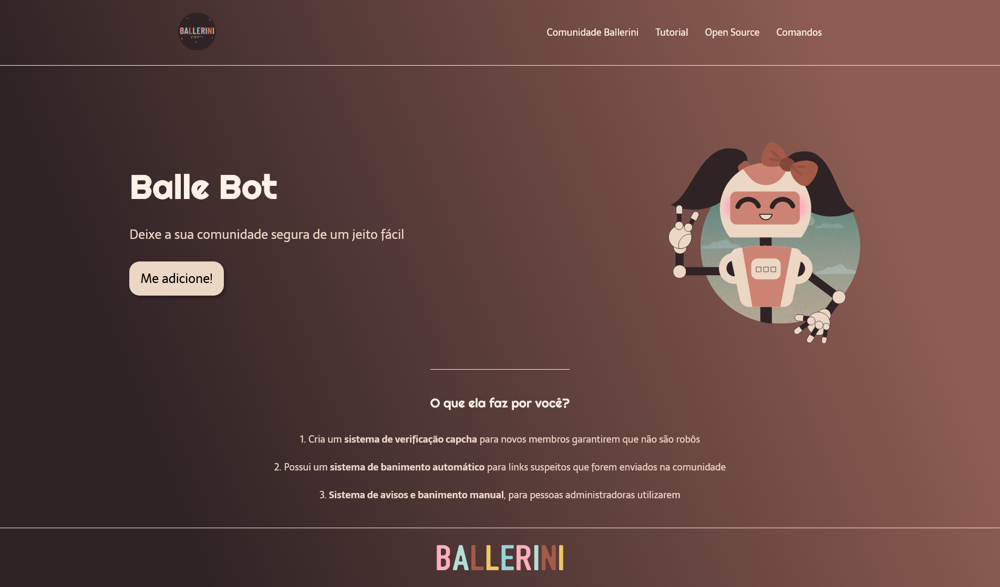

<h4 align="center">
  🚀 Balle Bot
</h4>

  

  
  
  

  

  

  <a href="#-tecnologias">Tecnologias</a>&nbsp;&nbsp;&nbsp;|&nbsp;&nbsp;&nbsp;
  <a href="#-projeto">Projeto</a>&nbsp;&nbsp;&nbsp;|&nbsp;&nbsp;&nbsp;
  <a href="#-layout">Layout</a>&nbsp;&nbsp;&nbsp;|&nbsp;&nbsp;&nbsp;
  <a href="#memo-licença">Licença</a>

 

Pode acessar a pagina por <a href='https://lucianocoelho-28.github.io/ballerini-landing-page/'> Aqui</a>

  

## 🚀 Tecnologias

Esse projeto foi desenvolvido com as seguintes tecnologias:

- HTML
- CSS

Bibliotecas

- [Google Fonts](https://fonts.google.com/)
- [Guia do Flexbox](https://css-tricks.com/snippets/css/a-guide-to-flexbox/)
- [Extensão Live Server](https://marketplace.visualstudio.com/items?itemName=ritwickdey.LiveServer)

Utilitários

- [Comunidade Ballerini no Discord](https://discord.com/invite/wagxzStdcR)
- [IconMoon](https://icomoon.io/app/#/select)

## 💻 Projeto

Esse projeto foi feito em conjunto com o <a href='https://www.youtube.com/watch?v=llF6vD-RljE'>video da Rafaella Ballerini</a>
Contém as seguintes seções: Header, Navigation, Main, Section, Comunidade Ballerini, Tutorial, Open Source, Comandos, GitHub e Footer

## 🔖 Layout

Você pode visualizar o layout do projeto através [desse link](https://www.figma.com/file/myqP66iQwzjwjrIAJyyrip/BalleBot?node-id=0%3A1). É necessário ter conta no [Figma](https://figma.com) para acessá-lo.

## :memo: Licença

Esse projeto está sob a licença MIT. Veja o arquivo [LICENSE](LICENSE) para mais detalhes.

--- 
